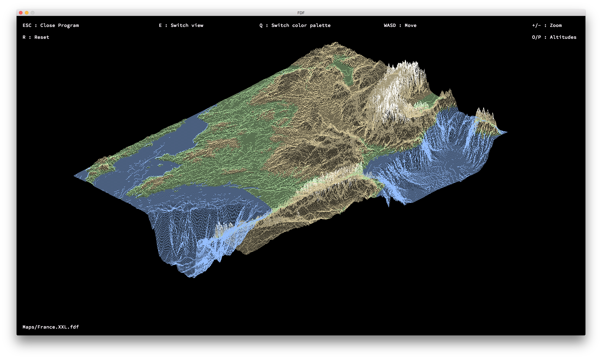
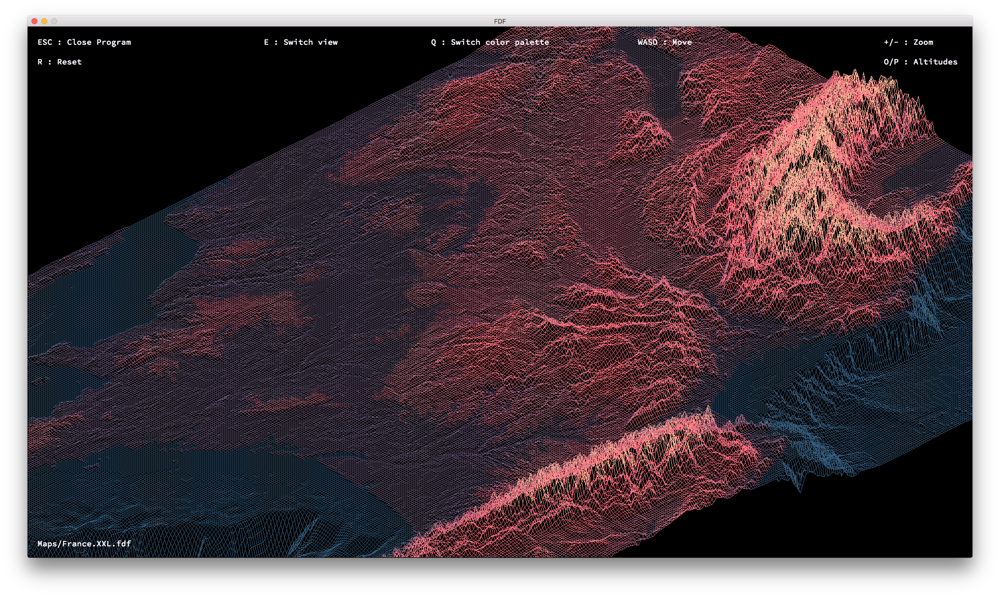
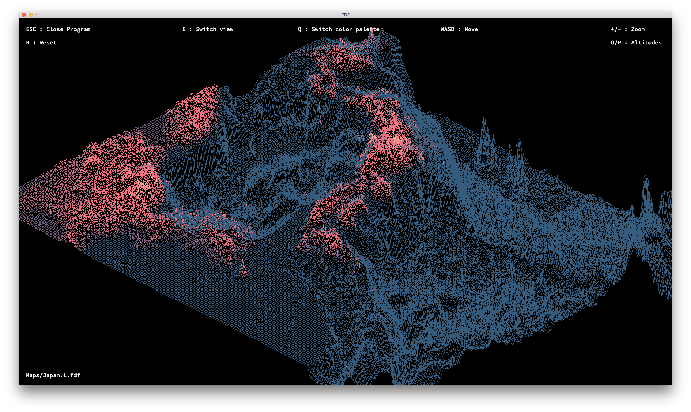
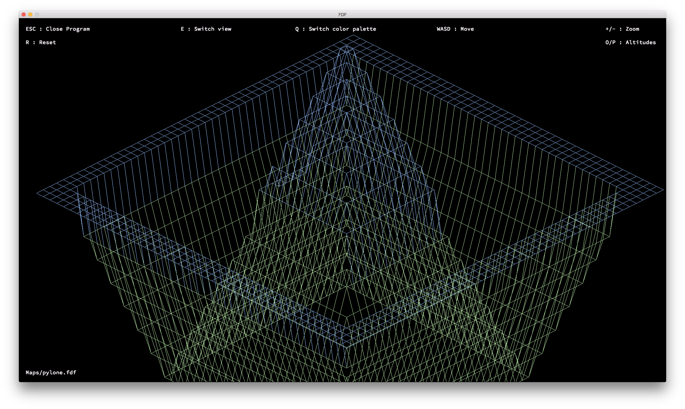

# Fdf

A project about creating a simplified 3D graphic representation of a relief landscape - to discover the basics of graphic programming, and in particular how to place points in space, join them with segments and observe the scene from a particular viewpoint. In this project, we are creating a simplified graphic "wireframe" ("fils de fer" in french, hence the name of the project) representation of a relief landscape linking various points (x, y, z) via segments. The coordinates of this landscape are stored in a file passed as a parameter to our program.

## How to use

- Compile : `make`
- Remove object files : `make clean`
- Remove object files and program : `make fclean`
- Start fresh and re-compile : `make re`

## Executing

Execute the program with the map file of your choice like this : `./fdf yourfile`

You can also use the test maps located in the `/Maps` directory.

## Warning

This program is using the minilibx, a Mac OS graphic library developped at 42 school which we are using in our first graphic programming projects. Therefore, it won't compile if you are on a Linux OS.

## Screenshots

